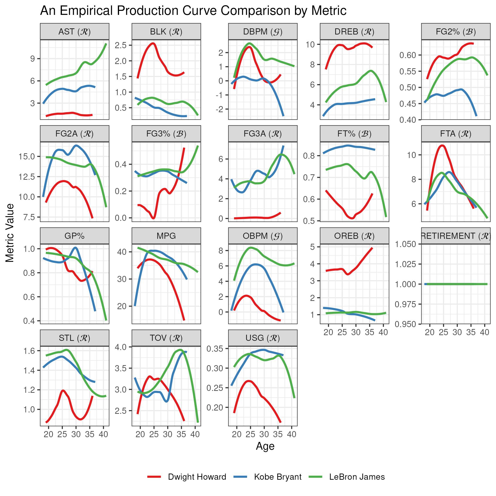
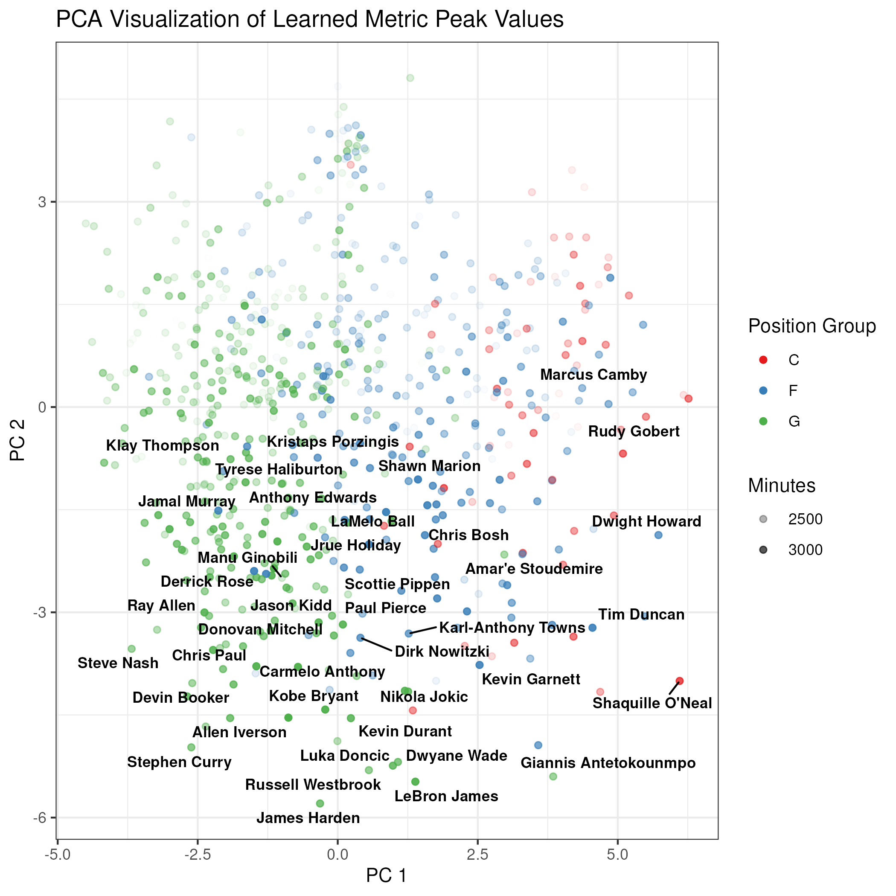
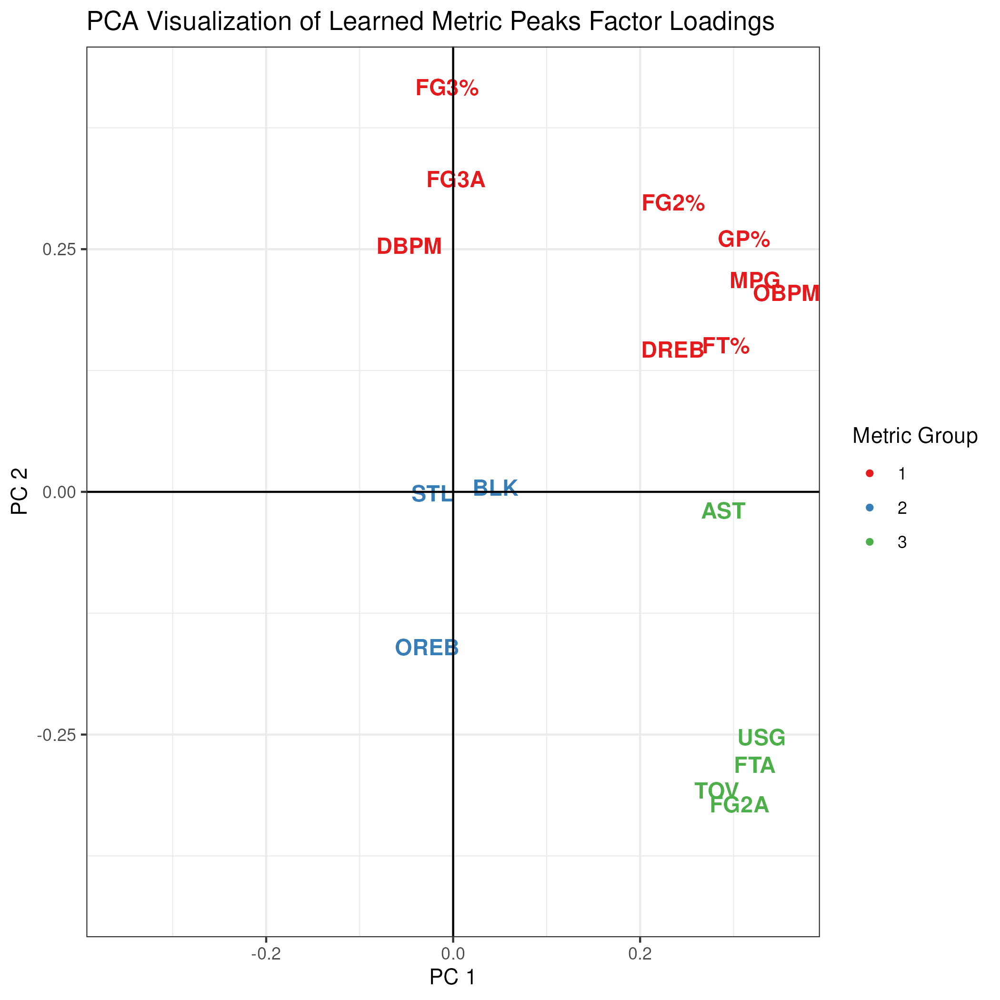

---

# Overview {.smaller}
- Introduce the problem of modeling NBA player career trajectories and the importance of incorporating realistic aging dynamics and injury effects.
- Discuss a novel prior on concave functions to encode realistic aging dynamics.
- Illustrate application of this prior in a Bayesian model of NBA player trajectories.
- Discuss inference challenges and present preliminary results on trajectory estimation and injury impact analysis.
 
---

# Motivation {.smaller}
{fig-cap="Example empirical player production curve" width="78%"}

# Multiple Metrics of Performance {.smaller}
- We can think of metrics as a combination of two broad categories:
1. Skill-based metrics (e.g. OBPM, FT%) that capture a player's skill and basketball IQ.
2. Athleticism-based metrics (e.g. BLK rate, STL rate)

- More importantly, two different athletes can express certain metrics through different combinations of skill and athleticism. 

# Skill Acquisition and Aging in Sports {.smaller}
- Skill acquisition phase: early career improvement as players develop skills and adapt to the league.
- Peak performance phase: players reach their maximum potential, often in their late 20s to early 30s.
- Decline phase: performance declines due to aging, wear-and-tear, and reduced athleticism.

# Data Overview {.smaller}
- 28 seasons of NBA player season-level aggregate data (1997-2025) from Basketball Reference.
- "K" metrics (e.g. OBPM, Games Played, STL Rate) capturing skill and/or athleticism.
- "M" injury indicators (e.g. ACL tear, Achilles rupture) with timing.
- "P" $\approx$ 2800 players with at least 1 season of data.
- "T" = 20 seasons of potential career length (age 18-38).
- Metrics only observed when players are active (mix of MNAR/ MAR).
- Heteroscedastic noise: more variability in some metrics (e.g. Games Played) than others (e.g. FT%).

# What we Hope to Learn {.smaller}
1. Can we project when an athlete will peak and how long they will maintain peak performance?
2. Can we categorize subtypes of metrics that respond differently to aging and injury?
3. Can we identify which types of athletes load more on skill vs. athleticism, and how this affects their aging trajectories and response to injury?

# Model Assumptions {.smaller}
1. \textcolor{blue}{Player heterogeneity is captured by latent embeddings.}
2. \textcolor{green}{Player trajectories are smooth and concave in age, with a single peak.}
3. \textcolor{red}{Injuries induce a shock and recovery trajectory that is learned from data.}
4. \textcolor{purple}{Short-term deviations around the aging curve are modeled as a noise process.}
5. \textcolor{orange}{Observational noise is heteroscedastic and metric-specific.}

\only<1>{
$$
{\color{blue}{X_p}} \sim N(0, I_D)
$$
}

\only<2>{
$$
{\color{green}{f^k(X,t)}} \sim MCP(\Theta; X)
$$
}

\only<3>{
$$
{\color{red}{\tau^k_{ptm}}} \sim N(w_m^T\tau^{*}_k, \sigma^2_{k})
$$
}

\only<4>{
$$
{\color{purple}{r_p^k(t)}} \sim AR(1)
$$
}

\only<5>{
$$
\begin{aligned}
\mu^k_{ptm} &= {\color{green}{f^k(X_p,t)}} + {\color{red}{\tau^k_{ptm}}} + {\color{purple}{r_p^k(t)}} \\
{\color{orange}{Y^k_{pt}}} &\sim \operatorname{EF}\!\left({\mu^k_{pt}},\, {\color{orange}{\phi^k_{pt}}}\right)
\end{aligned}
$$
}

# Model Inference Challenges {.smaller}
- High-dimensional parameter space with complex dependencies.
- Identifiability issues between player embeddings, injury effects, and aging curves
- A rotation matrix $R$ can be applied to the latent space such that $w_L^T X = w_l^T R R^{-1} X$, which preserves the likelihood but creates non-identifiability between $w_l$ and $X$.

# Proposed Inference Approach {.smaller}

## Addressing Additive Components and Identifiability

1. Fit the concave function and AR components first to the data (mask out injured time-points from the likelihood) without the injury component to get a MAP estimate of the aging curve and AR parameters.
2. Fix the concave function and AR parameters to their MAP estimates, and then fit the injury component to the residuals to get a MAP estimate of injury effects.

# Proposed Inference Approach (cont.) {.smaller}

## Addressing Rotational Ambiguity in Latent Space
1. Initialize parameter values using the MAP procedure found by Stochastic Gradient Descent (SGD).
2. Fix hyperparameters to their MAP estimates to reduce dimensionality, as these are often well-identified and less critical for uncertainty quantification.
3. To address rotational ambiguity for the latent factor models, fix factor loadings to their MAP estimates, and allow the latent embeddings to vary during MCMC sampling. (Mauri and Dunson, 2025)
4. Run MCMC sampling (e.g. NUTS) over the remaining parameters to obtain posterior samples for trajectory estimation and injury impact analysis.

# Concavity  
A function $f(t)$ is concave on some interval $[a,b]$ if it's second derivative is non-positive:
$$
f''(t) \leq 0 \quad \text{for all } t \in [a,b].
$$

Therefore, any function of the form
$$
f(t) = \beta_0 + \beta_1 (t-t_0) + \int_{t_0}^{t} \int_{t_0}^{s} f''(z) \, dz \, ds,
$$
is concave as long as $f''(t) \leq 0$ for all $t$.

# Theory: Prior on Concave Functions {.smaller}

**Proposition (Concave function prior).** Define

$$
h(t) = \beta_0 + \beta_1 (t-t_0) - \int_{t_0}^{t} \int_{t_0}^{s} [g(z)]^2 \, dz \, ds,
$$

with $g(z)$ a Gaussian process; this induces a concave prior over continuous trajectories.

---

# Theory: Prior on Concave Functions {.smaller}

**Proof sketch.** 

The prior over $h$ is induced by the Gaussian process prior over $g$, which is a valid probability measure over continuous functions. Hence, this *continuous* transformation $T(g)$ defines a valid prior over concave functions.

$$
T(g) = \beta_0 + \beta_1 (t-t_0) - \int_{t_0}^t \int_{t_0}^s g(z)^2 \, dz \, ds
$$

# Theory: Peak Constraints {.smaller}

The following constraints on $\beta_0$ and $\beta_1$ ensure a peak of $f$ at $t_{\max}$ with value $f_{\max}$:

1. $f(t_{\max}) = f_{\max}$
2. $\left.\dfrac{d}{dt}f(t)\right|_{t=t_{\max}} = 0$

\only<3->{
$$
\beta_1 = \int_{t_0}^{t} [g(z)]^2 \, dz
$$
$$
\beta_0 = f_{\max} - \beta_1(t_{\max}-t_0) + \int_{t_0}^{t_{\max}} \int_{t_0}^{s} [g(z)]^2 \, dz \, ds
$$
}

\only<4->{
$$
\begin{aligned}
f(t) &= f_{\max} + (t-t_{\max})\int_{t_0}^{t_{\max}} g(z)^2\,dz - \int_t^{t_{\max}}\int_{t_0}^{s} g(z)^2\,dz\,ds
\end{aligned}
$$
}

---

# Theory: Behavior of Concave Prior {.smaller}
**Expected Value of f(t)** (conditioning on $t_{\max}, f_{\max}$):

- Start from the constrained concave prior
  $$
  f(t)=f_{\max} + (t-t_{\max})\int_{t_0}^{t_{\max}} g(z)^2\,dz
  -\int_t^{t_{\max}}\int_{t_0}^{s} g(z)^2\,dz\,ds.
  $$
- Take conditional expectation term-by-term:
  $$
  \begin{aligned}
  E[f(t)\mid t_{\max},f_{\max}] &= f_{\max} \\
  &\quad + (t-t_{\max})\int_{t_0}^{t_{\max}} E[g(z)^2]dz \\
  &\quad -\int_t^{t_{\max}}\int_{t_0}^{s} E[g(z)^2]dz\,ds.
  \end{aligned}
  $$

---

# Theory: Behavior of Concave Prior (cont.) {.smaller}
- For a zero-mean separable GP, $E[g(z)^2]=\mathrm{Var}(g(z))=\sigma^2$.
- Substitute and integrate:
  $$
  \begin{aligned}
  E[f(t)\mid t_{\max},f_{\max}] &= f_{\max} \\
  &\quad + \sigma^2 (t_{\max}-t_0)(t-t_{\max}) \\
  &\quad - \sigma^2\frac{(t_{\max}-t)^2}{2}.
  \end{aligned}
  $$

- Simplify:
  $$
  \begin{aligned} 
  E[f(t)\mid t_{\max},f_{\max}] &= -\frac{\sigma^2}{2}(t - t_0)^2 + \frac{\sigma^2}{2}(t_{max} - t_0)^2 +  f_{\max} 
  \end{aligned}
  $$
- This is intuitive, as it is a parabolic function with maximum at $t_{\max}$, value $f_{\max}$, and curvature determined by $\sigma^2$. 

# Theory: Behavior of Concave Prior (cont.) {.smaller}
- The variance of $f(t)$ is determined by the variance of the double integral of the squared GP

**Variance of f(t)** (conditioning on $t_{\max}, f_{\max}$ fixed):
$$
  f(t)=f_{\max} + (t-t_{\max})\int_{t_0}^{t_{\max}} g(z)^2\,dz
  -\int_t^{t_{\max}}\int_{t_0}^{s} g(z)^2\,dz\,ds.
$$

- take definition of variance:
  $$
    \begin{aligned}
    Var[f(t)\mid t_{\max},f_{\max}] &= E[f(t)^2\mid t_{\max},f_{\max}] - E[f(t)\mid t_{\max},f_{\max}]^2 \\
    \end{aligned}
  $$

# Theory: Behavior of Concave Prior (cont.) {.smaller}

Roughly (omitting a lot of math), the variance grows quartically as we move away from the peak, with curvature determined by $\sigma^4$:

$$
  \begin{aligned}
  Var[f(t)\mid t_{\max},f_{\max}] &\propto  2\sigma^4 (t - t_{max})^4 \\
  \end{aligned}
$$

- Why (Isserlis Theorem)?
  $$
  \begin{aligned}
  E[f(t)^2] &\approx E \bigg[ \bigg( \int_t^{t_{max}} \int_t^s g(z)^2 dz ds \bigg)^2 \bigg] \\
  &\approx E \bigg[ \int_t^{t_{max}} \int_t^s \int_t^{t_{max}} \int_t^{s'} g(z)^2 g(z')^2 dz dz' ds  ds' \bigg] \\
  &\approx \int_t^{t_{max}} \int_t^s \int_t^{t_{max}} \int_t^{s'} E[g(z)^2 g(z')^2] dz dz' ds  ds' \\
  & \approx 3 \sigma^4 \frac{(t - t_{max})^4}{4}
  \end{aligned}
  $$
---

# Theory: Practically Squaring a GP {.smaller}

1. HSGP approximation (Solin and Särkkä, 2020):
$$
g(t) \approx \sum_{l=1}^K S(\sqrt{\lambda_l})^{1/2} \alpha_l \psi_l(t)
$$

2. Basis functions:
$$
\psi_l(t) = \sqrt{\frac{1}{L}}\sin(\sqrt{\lambda_l}(L + t))
$$

3. Squared exponential spectral density:
$$
S(\omega) = \sigma^2 \sqrt{2\pi}\, l\, \exp\!\left(-\frac{1}{2}l^2 \omega^2\right) = \int_{-\infty}^\infty \exp\!\left(-\frac{\tau^2}{2l^2} \right) e^{-i\omega\tau} d\tau
$$

---

# Theory: Practically Squaring a GP (cont.) {.smaller}

Let
$$
\tilde{\alpha_l} = S(\sqrt{\lambda_l})^{1/2} \alpha_l, c_{lm} = \tilde{\alpha}_l \tilde{\alpha}_m.
$$

Then the squared process can be written compactly as:
$$
[g(t)]^2 \approx \bigg(\sum_{l=1}^K \tilde{\alpha_l} \psi_l(t) \bigg)^2 = \sum_{l=1}^K \sum_{m=1}^K c_{lm}\,\psi_l(t)\psi_m(t).
$$

Hence,
$$
\int_{t_0}^{t} \int_{t_0}^{s} [g(z)]^2 \, dz \, ds
\approx \sum_{l=1}^K \sum_{m=1}^K c_{lm}
\int_{t_0}^{t} \int_{t_0}^{s} \psi_l(z)\psi_m(z) \, dz \, ds.
$$ 

# Theory: Analytical Solution for Double Integral {.smaller}
Recall that 
$\psi_l(z) = \sqrt{\frac{1}{L}}\sin(\sqrt{\lambda_l}(L + z))$:

\small
$$
\begin{aligned}[t]
\int_{t_0}^{t} \int_{t_0}^{s} \psi_l(z)\psi_m(z) \, dz \, ds &= \Psi_{lz}(t), \\
\Psi_{lz}(t) &= \begin{cases}
\dfrac{\cos(\epsilon_{lz}^{+}(t+L)) - 1}{2L(\epsilon_{lz}^{+})^2} + \dfrac{(t+L)^2}{4L},
l = z, \\
\dfrac{\cos(\epsilon_{lz}^{+}(t+L)) - 1}{2L(\epsilon_{lz}^{+})^2} - \dfrac{\cos(\epsilon_{lz}^{-}(t+L)) - 1}{2L(\epsilon_{lz}^{-})^2},
l \neq z.
\end{cases}
\end{aligned}
$$
\normalsize

$\epsilon_{lz}^{+} = \sqrt{\lambda_l} + \sqrt{\lambda_z}$, $\epsilon_{lz}^{-} = \sqrt{\lambda_l} - \sqrt{\lambda_z}$, $t_0 = -L$

# Theory: HSGP Approx. Convergence {.smaller}
::: {.proposition}

Let $k$ be a stationary covariance function on $[0,T]$ with spectral density $S$, and let $\{\phi_i,\lambda_i\}_{i=1}^\infty$ be the Laplacian eigenpairs on $[0,T]$.
Define $\omega_i = \sqrt{\lambda_i}$.
Let
$$
g(t)
=
\sum_{i=1}^\infty
\sqrt{S(\omega_i)}\,\alpha_i \psi_i(t),
\qquad
\alpha_i \stackrel{iid}{\sim} N(0,1),
$$
and its truncation
$$
g_K(t)
=
\sum_{i=1}^K
\sqrt{S(\omega_i)}\,\alpha_i \psi_i(t).
$$
Define
$$
f(t)
=
\int_0^t \int_0^s g(z)^2\,dz\,ds,
\qquad
f_K(t)
=
\int_0^t \int_0^s g_K(z)^2\,dz\,ds.
$$
Then
$$
f_K \overset{D}{\to} f
\quad  [0,T].
$$
:::

# Theory: HSGP Approx. Convergence (cont.) {.smaller}

**Proof sketch.** By the HSGP construction, the covariance operator admits the spectral approximation
$$
k(t,t')
\approx
\sum_{i=1}^K S(\omega_i)\psi_i(t)\psi_i(t').
$$

which approximates the true covariance of $g$ uniformly as $K\to\infty$ (Solin and Sarkkä, 2020). 

- the sum $g_k$ is mean-zero Gaussian with covariance function given by the spectral approximation above

- the finite-dimensional distributions of $g_K$ converge to those of $g$, since the covariances coincide in the limit.  

- $I(g) = \int_0^t \int_0^s g(z)^2\,dz\,ds$ is continuous, the finite-dimensional distributions of $f_K = I(g_K^2)$ converge to those of $f = I(g^2)$ in distribution. 

# Prior Predictive Behavior {.smaller}

Show demo

# Adding Additional Dimensions {.smaller}
Let's say we have additional covariates $X$ that we want to condition on. We can extend the concave prior construction as follows to maintain concavity in $t$ for each fixed $X$:
$$
f(X,t) = \beta_0 + \beta_1 (t-t_0) - \int_{t_0}^{t} \int_{t_0}^{s} [g(z, X)]^2 \, dz \, ds,
$$

where $g(z, X)$ is a Gaussian process over the joint space of $z$ and $X$. In our case, $g(z, X) \sim GP(0, k(z,z')k(X,X'))$, where the covariance function is separable over the time and covariate spaces.

# Adding Additional Dimensions (cont.) {.smaller}
The same constraints can be applied to ensure a peak at $t_{\max}(X)$ for each fixed $X$, with value $f_{\max}(X)$:

1. $f(X,t_{\max}(X)) = f_{\max}(X)$
2. $\left.\dfrac{d}{dt}f(X,t)\right|_{t=t_{\max}(X)} = 0$

# Adjusting the HSGP Approx. {.smaller}
- Keep time basis functions $\psi_l(z)$ unchanged.
- Let weights depend on covariates: $\alpha_l(X)$.
- This preserves the HSGP structure in time while allowing variation across $X$.
$$
g(t, X) \approx \sum_{l=1}^K S(\sqrt{\lambda_l})^{1/2} \alpha_l(X) \psi_l(t)
$$

- Model weights as independent Gaussian processes: $\alpha_l(X) \sim GP(0, k(X,X'))$.
- Squaring/integration steps are unchanged; only coefficients now vary with $X$.

# Adjusting the HSGP Approx. (cont.) {.smaller}
Is the covariance of $g(z,X)$ still approximately separable in $z$ and $X$?

**Proof sketch:** 

$$
\begin{aligned}
\uncover<1->{\operatorname{Cov}(g(z,X), g(z',X')) &= \operatorname{Cov}\left(\sum_{l=1}^K S(\sqrt{\lambda_l})\psi_l(z)\alpha_l(X),\right.} \\
\uncover<1->{&\qquad \left.\sum_{m=1}^K S(\sqrt{\lambda_m})\psi_m(z')\alpha_m(X')\right)} \\
\uncover<2->{&= \sum_{l=1}^K \sum_{m=1}^K S(\sqrt{\lambda_l})^{1/2} S(\sqrt{\lambda_m})^{1/2} \psi_l(z)\psi_m(z')} \\
\uncover<2->{&\qquad \cdot\,\operatorname{Cov}(\alpha_l(X), \alpha_m(X'))} \\
\uncover<3->{&= \sum_{l=1}^K S(\sqrt{\lambda_l})\psi_l(z)\psi_l(z')\operatorname{Cov}(\alpha_l(X), \alpha_l(X'))} \\
\uncover<4->{&= k(X,X')\sum_{l=1}^K S(\sqrt{\lambda_l})\psi_l(z)\psi_l(z')} \\
\uncover<5->{&\approx k(X,X')k(z,z')}
\end{aligned}
$$

# Adjusting the HSGP Approx. (cont.) {.smaller}
- Simple choice: linear kernel $k(X,X')$.
- Then $\alpha_l(X) = w_l^T X$ (Bayesian factor model form).
- Each basis function has its own weight vector $w_l \sim N(0, I)$.

# Adjusting the HSGP Approx. (cont.) {.smaller}

Some Notes:

- Different kernels $k(X,X')$ can be used to capture different covariate effects on trajectory shape.
- Framework remains valid as long as $\alpha_l(X)$ are GP-distributed.
- Can apply HSGP/linearized approximations over $k(X, X')$ for scalability.
- resulting process $f(X,t)$ is not separable due to transformations

# Concave Prior for Non-Gaussian Response
- The concave prior is on the latent function $f(X,t)$, which can be linked to observed data through a likelihood model.
- Consider Poisson observations with a log link:
$$
\begin{aligned}
\eta(X,t) &= f(X,t) \\
Y(X,t) &\sim \operatorname{Poisson}(\exp(\eta(X
,t)))
\end{aligned}
$$

- Since the exponential link is monotone, peak location and peak value priors can still be effective, while concavity isn't necessarily preserved in the observed data space.

# Model Specifics {.smaller}
- Concave function modeled using the HSGP approximation with $5$ basis functions.
- AR(1) noise process with metric-specific parameters, $\rho^k$ and $\sigma^k$.
- Latent player embeddings of dimension $D=21$.
- $f_{max}(X), t_{max}(X)$ modeled as linear functions of the latent embeddings centered around empirical means.

# Model Results

::: {.columns}
::: {.column width="50%"}
{width="100%"}
:::

::: {.column width="50%"}
{width="100%"}
:::
:::

---

# Model Results: PCA

{width="78%"}

---

# Model Results: Metric Types

{width="78%"}

---

# Injury Impact Estimation 

We define the causal estimand of interest as the mean effect of injury on a given metric, averaged across all injured time-points and players. 

We make the following causal assumptions (which may or may not be true in our data, but are necessary for identification of the estimand):

1. No unmeasured confounding: all confounders of the injury-outcome relationship are observed and included in the model (e.g. age, position, prior performance).
2. Consistency: the potential outcome under the observed injury status is equal to the observed outcome.
3. Positivity: there is a non-zero probability of being injured or not injured for all combinations of confounders.

# Average Injury Treatment Effect

ATE is the average difference in the metric of interest between the injured and counterfactual non-injured state, averaged across all injured time-points and players. In our model, the posterior of $\tau_{mk}$ represents the ATE of injury on each metric.

{width="82%"}

# Modeling Counterfactual Trajectories

 Adjust the predicted trajectories for injured time-points by subtracting the estimated injury effect from the full prediction

{fig-align="center" width="70%"}

---

# Future Work
1. Model Validation
2. Time Decay of Injury Effects
3. Injury Heterogeneity Analysis
4. Extending a survival model to assess impact of injury on career longevity.

